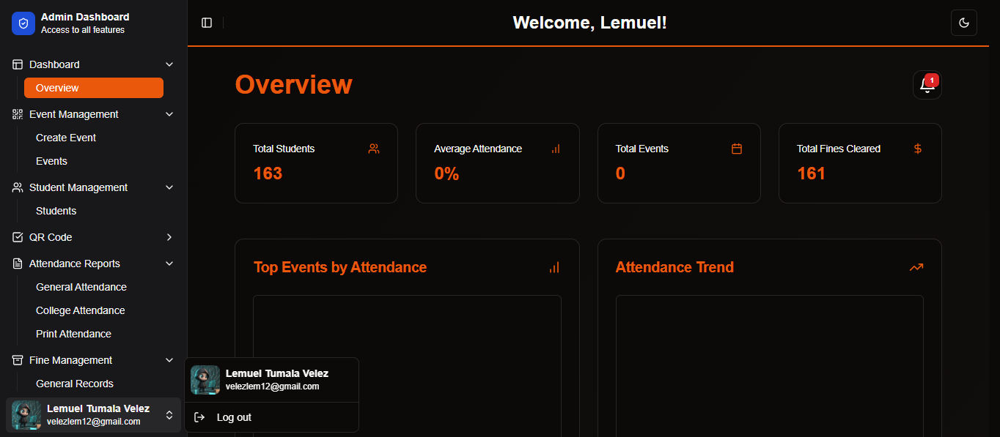

<div align="center">

# SSG Attendance and Participation Tracking System


[](https://nextjs.org/)
[](https://reactjs.org/)
[](https://tailwindcss.com/)
[](https://appwrite.io/)
[](https://www.typescriptlang.org/)
[](https://opensource.org/licenses/Apache-2.0)


</div>

---

## 🎯 Objective

Design and implement a comprehensive web application for the Supreme Student Government (SSG) to streamline attendance management at events and meetings. This system empowers students with registration, QR code-based check-ins, and personalized dashboards, while providing administrators with powerful tools for event management and reporting.

## ✨ Features

### Core Functionality

- **🔐 Secure Authentication**:
  - Student registration with personal information
  - Login system with role-based access (student/admin)

- **👤 Personalized Dashboards**:
  - Student view: Event participation, attendance history, notifications
  - Admin view: Event management, reporting tools, system settings

- **📱 QR Code Integration**:
  - Generate unique QR codes for events
  - Personal QR codes for students
  - Seamless check-in process via QR scanning

- **📊 Comprehensive Reporting**:
  - Detailed attendance reports
  - Export options (PDF)
  - Visual data representation with charts in dashboard overview

### Enhanced User Experience

- **🌄 Dark Mode**: Toggle between light and dark themes
- **📱 Responsive Design**: Optimized for both desktop and mobile devices
- **⏱️ Time-Limited Access**: Enforce check-in time limits for accurate attendance tracking

### Administrative Tools

- **💰 Automated Fine System**:
  - Fines for event absences
  - Automatic calculation and tracking

- **🔄 Flexible Event Management**:
  - Create, edit, and delete events
  - Set attendance requirements and deadlines
---
## 📸 Screenshots

<div align="center">

### Authentication


### Password Recovery


### Student Dashboard


### Admin Dashboard



</div>

## 🚀 Tech Stack

### Frontend

- **[Next.js](https://nextjs.org/)** (v15.0.3): React framework for server-side rendering and static site generation
- **[React](https://reactjs.org/)** (v19.0.0-rc): A JavaScript library for building user interfaces
- **[Tailwind CSS](https://tailwindcss.com/)** (v3.4.15): Utility-first CSS framework
- **[Radix UI](https://www.radix-ui.com/)**: Unstyled, accessible components for building high‑quality design systems
- **[Lucide React](https://lucide.dev/)** (v0.460.0): Beautiful & consistent icon set
- **[Framer Motion](https://www.framer.com/motion/)** (v11.15.0): Animation library for React
- **[GSAP](https://greensock.com/gsap/)** (v3.12.5): Professional-grade animation for the modern web
- **[Recharts](https://recharts.org/)** (v2.15.0): Composable charting library for React
- **[QRCode.react](https://github.com/zpao/qrcode.react)** (v4.2.0): QR code component for React
- **[React Webcam](https://github.com/mozmorris/react-webcam)** (v7.2.0): Webcam component for React
- **[SweetAlert2](https://sweetalert2.github.io/)** (v11.14.5): Beautiful, responsive, customizable alert dialogs

### Backend

- **[Appwrite](https://appwrite.io/)** (v16.0.2): Open-source backend server for database management and authentication

### Data Processing & Utilities

- **[date-fns](https://date-fns.org/)** (v4.1.0): Modern JavaScript date utility library
- **[jsPDF](https://github.com/MrRio/jsPDF)** (v2.5.2) & **jsPDF-AutoTable** (v3.8.4): Client-side PDF generation
- **[jsQR](https://github.com/cozmo/jsQR)** (v1.4.0): A pure javascript QR code reading library

### Development Tools

- **[TypeScript](https://www.typescriptlang.org/)** (v5.6.3): Typed superset of JavaScript
- **[ESLint](https://eslint.org/)** (v8.57.1): Pluggable linting utility for JavaScript and TypeScript
- **[Autoprefixer](https://github.com/postcss/autoprefixer)** (v10.4.20): PostCSS plugin to parse CSS and add vendor prefixes
- **[PostCSS](https://postcss.org/)** (v8.4.49): Tool for transforming CSS with JavaScript

### Additional Libraries

- **[@babylonjs/core](https://www.babylonjs.com/)** (v7.35.2): 3D engine based on WebGL
- **[@tanstack/react-table](https://tanstack.com/table/v8)** (v8.20.6): Headless UI for building powerful tables & datagrids
- **[next-themes](https://github.com/pacocoursey/next-themes)** (v0.4.3): Perfect dark mode in Next.js
---
## 🚀 Getting Started

### Prerequisites

- Node.js (v14 or later)
- npm or yarn
- Git

### Installation

1. Clone the repository:

```bash
git clone https://github.com/your-username/ssg-attendance-tracking.git
cd ssg-attendance-tracking


Thought for 5 seconds```markdown project="SSG Attendance Tracking" file="README.md"
...
```

2. Install dependencies:


```shellscript
npm install
# or
yarn install
```

3. Set up environment variables:
Here's the updated section with dummy data for security purposes:


---

### 🔧 Environment Variables

To run the application, configure the following environment variables in the `.env.local` file at the root of your project:

```plaintext
NEXT_PUBLIC_APPWRITE_ENDPOINT=https://dummy.endpoint/v1
NEXT_PUBLIC_APPWRITE_PROJECT_ID=project_id_dummy
NEXT_PUBLIC_APPWRITE_DATABASE_ID=database_id_dummy
NEXT_PUBLIC_APPWRITE_USERS_COLLECTION_ID=users_collection_id_dummy
NEXT_PUBLIC_APPWRITE_EVENTS_COLLECTION_ID=events_collection_id_dummy
NEXT_PUBLIC_APP_URL=https://dummy-app-url.vercel.app
NEXT_PUBLIC_APPWRITE_AVATAR_BUCKET_ID=avatar_bucket_id_dummy
NEXT_PUBLIC_APPWRITE_GENERAL_ATTENDANCE_COLLECTION_ID=general_attendance_collection_id_dummy
NEXT_PUBLIC_APPWRITE_CollegeOfTeacherEducation_Attendance_COLLECTION_ID=teacher_education_attendance_id_dummy
NEXT_PUBLIC_APPWRITE_CollegeOfEngineering_Attendance_COLLECTION_ID=engineering_attendance_id_dummy
NEXT_PUBLIC_APPWRITE_CollegeOfCriminalJusticeEducation_Attendance_COLLECTION_ID=criminal_justice_attendance_id_dummy
NEXT_PUBLIC_APPWRITE_CollegeOfBusinessAdministration_Attendance_COLLECTION_ID=business_admin_attendance_id_dummy
NEXT_PUBLIC_APPWRITE_CollegeOfArtsAndSciences_Attendance_COLLECTION_ID=arts_sciences_attendance_id_dummy
NEXT_PUBLIC_APPWRITE_CollegeOfAgricultureAndForestry_Attendance_COLLECTION_ID=agriculture_forestry_attendance_id_dummy
NEXT_PUBLIC_APPWRITE_CollegeOfComputingStudies_Attendance_COLLECTION_ID=computing_studies_attendance_id_dummy
NEXT_PUBLIC_APPWRITE_FINES_MANAGEMENT_COLLECTION_ID=fines_management_collection_id_dummy
NEXT_PUBLIC_APPWRITE_EVENTS_NOTIFICATION_COLLECTION_ID=events_notification_collection_id_dummy
```

#### Notes:

- Replace these dummy values with your actual Appwrite configuration data during setup.
- Ensure the `.env.local` file is **not** committed to your repository to protect sensitive information.
- Copy the `.env.example` file to `.env.local`
- Fill in the required Appwrite credentials and other configuration details


4. Run the development server:


```shellscript
npm run dev
# or
yarn dev
```

5. Open [http://localhost:3000](http://localhost:3000) in your browser to see the application.


---

## 📖 Usage

Detailed usage instructions and documentation can be found in the [User Guide](docs/USER_GUIDE.md).

## 🤝 Contributing

We welcome contributions to improve the SSG Attendance and Participation Tracking System! Please follow these steps:

1. Fork the repository
2. Create your feature branch: `git checkout -b feature/AmazingFeature`
3. Commit your changes: `git commit -m 'Add some AmazingFeature'`
4. Push to the branch: `git push origin feature/AmazingFeature`
5. Open a pull request


## 📄 License

This project is licensed under the Apache License, Version 2.0 - see the [LICENSE](LICENSE) file for details.

## 🙏 Acknowledgements

- [Supreme Student Government](https://www.facebook.com/profile.php?id=61566578300898) for their support and feedback

