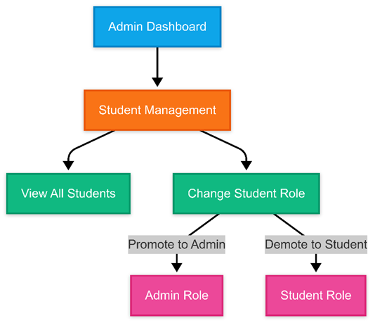

# SSG Attendance and Participation Tracking System
 
Your gateway to efficient, secure, and paperless attendance management.

---

## 🎯 Objective

The SSG Attendance and Participation Tracking System is designed to streamline attendance management for events and meetings using QR code-based check-ins. This system allows students to register, track attendance, and view participation history, while providing administrators with powerful tools for event management, real-time reporting, and automated fine processing.

---

## ✨ Features

### Core Functionality
- **🔐 Secure Authentication**
  - Student registration with required personal details.
  - Role-based login for students and admins.
- **👤 Personalized Dashboards**
  - Student View: Displays event participation, attendance history, and notifications.
  - Admin View: Offers event management tools, detailed reporting, and system settings.
- **📱 QR Code Integration**
  - Generate unique event QR codes for attendance tracking.
  - Each student receives a personal QR code for check-ins.
- **📊 Comprehensive Reporting**
  - Detailed attendance records with export options (PDF).
  - Visual data insights using charts and graphs for event participation tracking.

### Enhanced User Experience
- **🌄 Dark Mode**: Toggle between light and dark themes.
- **📱 Responsive Design**: Optimized for desktop and mobile use.
- **⏱️ Time-Limited Access**: Enforces check-in deadlines to maintain accurate attendance.

### Administrative Tools
- **💰 Automated Fine System**:
  - Automatically calculates fines for unexcused absences.
  - Tracks unpaid fines in student records.
- **🔄 Flexible Event Management**:
  - Easily create, edit, or delete events with attendance requirements and deadlines.

---

## 🚦 Attendance System Workflow

### Authentication Flow
1. **User Entry**: 
   - The user starts at the login/signup page.
2. **Registration**: 
   - New users sign up and are assigned the "Student" role by default.
3. **Login**: 
   - Existing users log in.
4. **Role Check**: 
   - The system verifies the user role and directs them to the appropriate dashboard.

### Student Dashboard
Students can access:
1. **Overview**: 
   - A summary dashboard displaying key information.
2. **Attendance History**: 
   - View events attended.
   - Check fines during clearance week.
3. **QR Code**: 
   - View and download their personal QR code for offline use.
   - Scan event QR codes.
4. **Settings**: 
   - Manage and update profile information.

### Admin Dashboard
Admins can access all student features plus additional tools:

 

1. **Event Management**: 
   - Create new events.
   - View and manage existing events.
   - Generate event QR codes.
   - Record attendance for events.

 

2. **Student Management**: 
   - View all student profiles.
   - Change student roles (promote to admin or demote to student).

 

3. **Attendance Reports**: 
   - Get a general attendance overview.
   - Generate segregated attendance reports.
   - Print attendance records.
4. **Fine Management**: 
   - View general fine records (generate fines for all students).
   - Access personal fine records (similar to attendance history).

### Attendance Recording Methods

#### Method 1: Admin Scans Student QR
- **Admin Side**: 
  1. Navigate to Events → Select event → Record Attendance.
  2. Scan the student's personal QR code.
- **Student Side**: 
  1. Go to QR Code → My QR Code.
  2. Download the QR code if needed (for offline use).
  3. Present the QR code to the admin (SSG officer).

#### Method 2: Student Scans Event QR
- **Admin Side**: 
  1. Navigate to Events → Select event → View QR Code.
  2. Download the event QR code if needed.
  3. Show the event QR code to the student.
- **Student Side**: 
  1. Go to QR Code → Scan QR Code.
  2. Scan the event QR code shown by the admin.

Both methods update the same attendance database. Method 2 serves as a backup when Method 1 fails (e.g., when a student's QR code is invalid or cannot be scanned).

---

## 🏆 Benefits

✅ **Paperless Recording**: Eliminates manual attendance tracking, reducing paperwork.  
✅ **Real-Time Attendance Data**: Ensures up-to-date attendance records for accurate monitoring.  
✅ **Instant Event Data Retrieval**: Automatically logs event participation details.  
✅ **Printable Reports**: Attendance records can be printed for verification and record-keeping.  
✅ **Stronger Security**: Enforces password validation to encourage stronger, more secure passwords.  
✅ **Automated Fines**: Applies fines for unexcused absences, ensuring student accountability.  
✅ **Administrative Efficiency**: Reduces manual work for staff, allowing them to focus on student engagement.  

---

## 🚀 Importance

The SSG Attendance and Participation Tracking System is essential for efficient and reliable attendance management because it:

- **Streamlines Operations**: Automates attendance recording, reducing human error and saving time.
- **Enhances Accountability**: Ensures accurate tracking of student participation, reinforcing event engagement.
- **Supports Sustainability**: Eliminates paper-based tracking, promoting eco-friendly operations.
- **Improves Decision-Making**: Provides insightful reports to help plan future events and optimize resources.
- **Ensures Accessibility**: Offline functionality ensures students without internet access can still have attendance recorded.
- **Boosts Security**: Enforces password policies and authentication measures to protect user data.

---

## ⚠️ Issues and Solutions

### 1. User Not Found
- **Issue**: Your account cannot be found due to a typographical error during registration (e.g., using "TC-24-00123" but logging in as "TC-24-A-00123").
- **Solution**: Double-check your login details. If the problem persists, contact the developer or SSG admin for assistance.

### 2. Invalid Credentials
- **Issue**: The entered password does not match the registered details.
- **Solution**: 
  - Verify your password.
  - If forgotten, click "Forgot Password" and follow the instructions in the reset email (check your spam folder if needed).

### 3. Failed Registration
- **Issue**: Registration failure due to an unstable internet connection, incorrect email format, or weak password.
- **Solution**: 
  - Use a stable internet connection when registering.
  - Ensure your email follows a proper format (e.g., example@gmail.com, not example..@gmail.com or example@gmail,com).
  - Follow the password requirements and retry registration.

### 4. Invalid QR Code
- **Issue**: The QR code scan fails due to email formatting errors during registration or device-related issues.
- **Solution**: 
  - Ensure you scan the event's QR code (not your personal QR) for attendance.
  - If issues persist, contact the developer or SSG admin for assistance.

---

## ❓ Frequently Asked Questions (FAQs)

### 1. What if I cannot go online? How will my attendance be recorded?
✅ **Answer**: After registering, download your personal QR code while online. You can then use it offline for attendance tracking. If you need assistance, contact the SSG admin.

### 2. My downloaded QR code is invalid when scanned. What should I do?
✅ **Answer**:
- If you have internet access, scan the event's QR code instead of your personal QR code.
- If you cannot go online, reach out to the developer for troubleshooting.

### 3. My attendance was recorded in the old system but is missing in the new one. How do I fix this?
✅ **Answer**:
- Attendance from the old system is no longer valid, as it could cause discrepancies with the automated fine calculations.
- If you attended an event recorded in the old system, please contact your SSG admin or the developer to notify them of your need to update your attendance records. Follow the instructions provided by them to have your previous attendance recorded in the new system.

### 4. I don't have a phone. How can my attendance be recorded?
✅ **Answer**:
- Contact the SSG admin or developer to create an account for you.
- You will receive either a soft copy of your QR code (digital format) or a printed copy, either of which can be used during attendance check-ins.

**IF THE ISSUE PERSISTS, CONSULT THE DEVELOPER**

### In the login page:

1. First click. 

2. Then click. 

---

## 📌 Conclusion

The SSG Attendance and Participation Tracking System simplifies event attendance management while ensuring security, accuracy, and efficiency. With its paperless recording, real-time data tracking, automated fines, and personalized dashboards, this system ensures that every student's participation is accounted for.

For further assistance or technical support, reach out to the SSG admin or developer.

**SSG Attendance System – Making Student Engagement Seamless!**